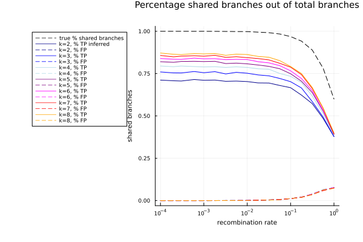
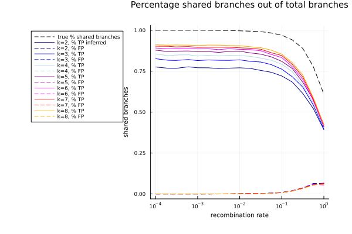
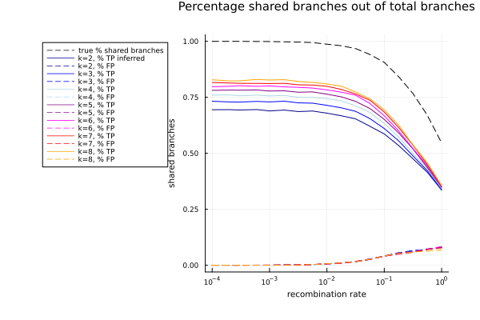
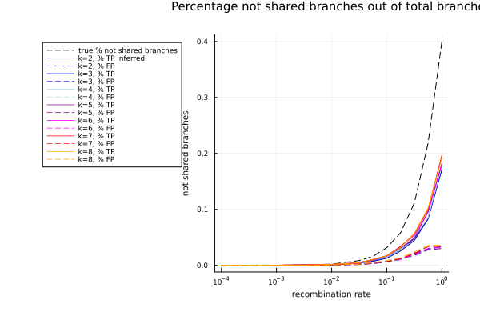
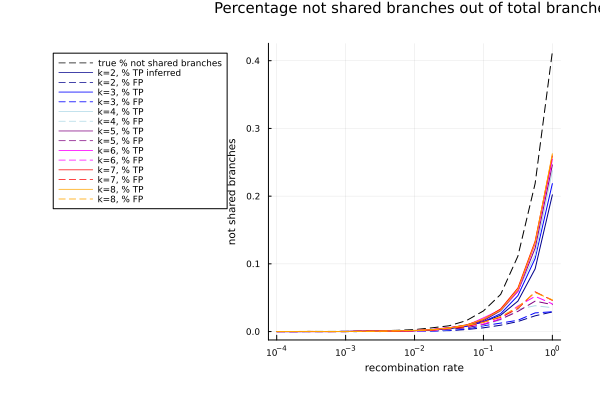
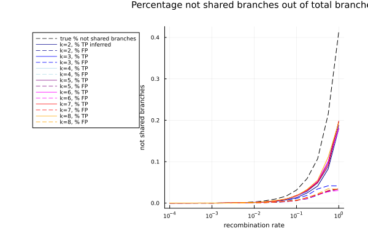

## Pipeline Steps

The Accuracy Shared Branches pipeline assesses the improvement in identifying branches as shared in tree pairs. This is important for tree parameter inference (see the [Divergence Time Estimation](../DivergenceTimeEstimations/) pipeline). If a branch is assumed to be shared amongst a subset of segment trees, information all the segment trees can be used together at that point in the tree as we believe that all segment trees share the same ancestral history at that point.

1. Use the julia package [ARGTools](https://github.com/PierreBarrat/ARGTools) to simulate recombination of eight segments with the flu/kingman coalescence model. See the [docs](https://github.com/PierreBarrat/ARGTools/tree/extended_newick_clean#simulations) for information on how these simulations are completed. Obtain individual segment trees for each segment in the ARG.
2. Randomly remove internal branches with probability $$e^{\frac{-\tau}{cN}}.$$ The parameter $N$ corresponds to the population size and $\tau$ is the branch length - branches are scaled to generation number as ARGTools uses a coalescence model. The parameter $c$ is determined in [MTKTools](https://github.com/anna-parker/MTKTools) and has been chosen to result in trees with a desired resolution rate (typically between 0.3 and 0.4 for influenza).
3. Take random subsamples of size $2 \leq K \leq 8$ trees and use MultiTreeKnit to infer the MCCs of all tree pairs in this random subset, in this process TreeKnit will additionally resolve each tree using every other tree (The $K=2$ case corresponds to standard TreeKnit). 
4. For each subsample of trees calculate the accuracy of shared branch labeling using `MTKTools.accuracy_shared_branches`. This takes a randomly chosen tree pair, with the true trees, the inferred trees and the true and inferred MCCs. For both the true and inferred trees and MCCs it calculates which branches are shared between tree pairs and not shared between tree pairs (using the `MTKTools.map_shared_branches` functionality). Then for each tree and its corresponding true tree it does the following: for all branches in the inferred tree check if their split exists in the true tree (i.e. if this branch is correct), if it exists check if is marked as a shared branch in both trees (TP), only in the real tree (FN), only in the inferred tree (FP) or in neither tree (TN). Additionally calculate how many branches in the true tree are shared and not shared for comparison. All values are additionally normalized the total number of branches in the tree ($2n - 1$). 
5. Write a summary of results to a txt file.
6. Plot results.
7. Remove unnecessary files and zip output files.

## Selected Results

In all cases using more segments allows the identification of more shared and unshared branches in trees. The total number of shared branches that can be identified using 8 segments is related to the resolution rate of the trees. More resolved trees lead to more branches being correctly identified. 

  

<em>Left: ARGs simulated under flu coalescence model and resolution rate 0.3 and strict resolve, Right: ARGs simulated under flu coalescence model and resolution rate 0.4 and strict resolve</em>

The structure of the curves is related to the composition of the trees - using Kingman trees the decrease in TP branches is less steep than in flu trees - this is most likely due to the fact that the coalescence rate in kingman trees is quadratic in the number of leaves, whereas the coalescence rate in flu is almost log linear. 

The reassortment rate is set to be proportional to the coalescence rate at time $t_0$, which means that at later times (internally) the ARG has a higher reassortment rate (relative to coalescence rate) in the Kingman model than in the flu model. For the 8 segment case at time $t$ assume that $$n_r(t) \approx n_c(t) < n_c(t_0) = n_r(t_0)$$ (for the 8 segment case this is quite likely: $n_r(t) < n_c(t)$ will only occur if a reassortment event has happened above the same node multiple times or if a reassortment event only splits off one segment). The ratio of the reassortment rate and coalescence rate in the Kingman model at time $t$ is:
$$\frac{\frac{\rho n_c(t_0) n_c(t)}{2 N}}{\frac{n_c(t)(n_c(t) - 1)}{2 N}} \approx \rho  \frac{n_c(t_0)}{n_c(t)}$$ 
The ratio of the reassortment rate and coalescence rate in the flu model at time $t$ is:
$$\frac{\frac{\rho n_c(t_0)^{0.2} n_c(t)}{2^(0.2) N}}{\frac{n_c(t)^{0.2}(n_c(t) - 1)}{2^(0.2) N}} \approx \rho  (\frac{n_c(t_0)}{n_c(t)})^{0.2}$$ 
See [ARGTools](https://github.com/PierreBarrat/ARGTools) for an exact derivation of coalescence and reassortment rates. this can be seen in the graphs below - where even at the same resolution rate the Kingman model has a smaller amount of shared branches. 

  

<em>Left: ARGs simulated under flu coalescence model and resolution rate 0.3 and strict resolve, Right: ARGs simulated under kingman coalescence model and resolution rate 0.3 and strict resolve</em>

The main difference between using strict vs liberal resolve is the number of incorrectly labeled branches. The number of FP branches (branches which are incorrectly labeled as shared) goes up when liberal resolve is used - the total number of TP stays relatively consistent. The number of FN and TN increases with liberal resolve - however this is most likely just due to the fact that strict resolve on average resolves less branches - especially branches which are not shared between a tree pair. 

  
<em>Left: ARGs simulated under flu coalescence model and resolution rate 0.3 and strict resolve, Right: ARGs simulated under flu coalescence model and resolution rate 0.3 and liberal resolve</em>

  
<em>Left: ARGs simulated under flu coalescence model and resolution rate 0.3 and strict resolve, Right: ARGs simulated under flu coalescence model and resolution rate 0.3 and liberal resolve</em>

Using the `consistent` flag has little impact on the results. 

  
<em>Left: ARGs simulated under flu coalescence model and resolution rate 0.3 and strict resolve, Right: ARGs simulated under flu coalescence model and resolution rate 0.3, strict resolve and the consistent flag</em>

  
<em>Left: ARGs simulated under flu coalescence model and resolution rate 0.3 and strict resolve, Right: ARGs simulated under flu coalescence model and resolution rate 0.3, strict resolve and the consistent flag</em>
