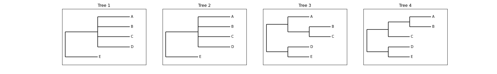

## Topological Compatibility Issues

Maximally Compatible Clades (MCCs) should fullfil their definition of being clades of two trees which share topology (also share topology upto resolution if desired). An MCC can be defined by its leaves. Given a set of leaves and a tree all leaves not in that set can be masked and the resulting subtree is the maximally compatible clade. If we calculate the split list of each clade in the two trees they should be the same (or if MCCs are defined upto resolution they should be compatible with each other). When run on two trees TreeKnit returns MCCs that fulfill these conditions. However, when MCCs are inferred on multiple trees and these trees are then further resolved in other trees we need to make sure that the first sets of MCCs that we inferred still fulfill these conditions even when trees are further resolved. 

Let us look at two cases where such an issue could arise. 

1. 
 

Now let us assume that we are using `liberal` resolve and we calculate the following MCC pairs:
$$MCC_{1,2} = [[A, B, C, D, E]]$$
$$MCC_{1,3} = [[D], [A, B, C, E]]$$ 
This leads to Tree1 being resolved using Tree3 and the $(B,C)$ split being added to Tree1
But now assume that the SA does not converge properly when we calculate $MCC_{2,3}$
$$MCC_{2,3} =  [[A], [D], [B, C, E]]$$
Tree2 will not be further resolved. This means that the two clades defined by $MCC_{1,2}$ are no longer the same - however they are still compatible up to resolution. (Note that under strict resolve the Tree1 would not be resolved as the location of $D$ is unclear which means that the two clades would still be compatible up to resolution- even if the MCCs are not consistent.)
 

2. 
 Now assume the same case but with an additional Tree4. 

As before 
$$MCC_{1,2} = [[A, B, C, D, E]]$$
$$MCC_{1,3} = [[D], [A, B, C, E]]$$ 
This leads to Tree1 being resolved using Tree3 and the $(B,C)$ split being added to Tree1
$$MCC_{1,4} = [[C], [D], [A, B, E]]$$
But now assume that the SA does not converge properly when we calculate $MCC_{2,3}$
$$MCC_{2,3} =  [[A], [D], [B, C, E]]$$
$$MCC_{2,4} =  [[D], [A, B, C, E]]$$
This leads to Tree2 being resolved using Tree4 and the $(A, B)$ split being added to Tree2.
This now means that the two clades defined by $MCC_{1,2}$ are not only not the same they are no longer compatible, even up to resolution. This means that $MCC_{1,2}$ is no longer an actual MCC. Which is quite an issue.
 

3. 
 

Let us now look at an example of topological incompatibility that could arise with `strict` resolve.

$$MCC_{1,2} = [[D], [A, B, C, E]]$$
However, as we are now using `strict` resolve and the location of `D` cannot be determined from the other tree - i.e. we could introduce the split $(B, C)$ or $(B, C, D)$ - Tree1 shall not be further resolved.
$$MCC_{1,3} = [[A, B, C, D, E]]$$ 
Now Tree1 shall be resolved using Tree3 - the split $(A, B)$ shall be introduced.
$$MCC_{2,3} =  [[A], [D], [B, C, E]]$$
This now means that the two clades defined by $MCC_{1,2}$ are not only not the same they are no longer compatible, even up to resolution. This means that $MCC_{1,2}$ is no longer an actual MCC. This is again an issue.
 

## Potential Ways to Solve Topological Incompatibilities

1. Improve SA

a. pre resolve all trees by introducing splits that are compatible with all tree topologies before inferring individual tree pairs. 

b. add a consistent constraint which will push the SA to choose MCCs which are consistent with previously inferred MCCs - leading to less issues with incompatible resolutions.

Note that as SA is a stochastic process this will not fix the issue but could potentially make it less likely.

2. As all these issues arise from incompatible resolution and will potentially occur with `liberal` and `strict` resolve - adding a final round of TreeKnit which nolonger resolves trees but computes MCCs using the trees as resolved in a previous round should prevent any topological incompatibilities. This will however most likely split up MCCs too much. 

## Pipeline Steps

1. Use the julia package [ARGTools](https://github.com/PierreBarrat/ARGTools) to simulate recombination of eight segments with the flu/kingman coalescence model. See the [docs](https://github.com/PierreBarrat/ARGTools/tree/extended_newick_clean#simulations) for information on how these simulations are completed. Obtain individual segment trees for each segment in the ARG.
2. Randomly remove internal branches with probability $$e^{\frac{-\tau}{cN}}.$$ The parameter $N$ corresponds to the population size and $\tau$ is the branch length - branches are scaled to generation number as ARGTools uses a coalescence model. The parameter $c$ is determined in [MTKTools](https://github.com/anna-parker/MTKTools) and has been chosen to result in trees with a desired resolution rate (typically between 0.3 and 0.4 for influenza).
3. Take random subsamples of size $2 \leq K \leq 8$ trees and use MultiTreeKnit to infer the MCCs of all tree pairs in this random subset, in this process TreeKnit will additionally resolve each tree using every other tree (The $K=2$ case corresponds to standard TreeKnit). 
4. Compute average number of clade pairs defined by an MCC which are not the same but are topologically compatible and the maximal number of clade pairs defined by an MCC which are not  the same and are not topologically compatible - this is an error which should be avoided. Look at cases where multiple rounds are used, no resolution occurs in the final round and where all trees are resolved as much as possible prior to pairwise TreeKnit inference to find the optimal subroutine. 
5. Write a summary of results to a txt file.
6. Plot results.
7. Remove unnecessary files and zip output files.