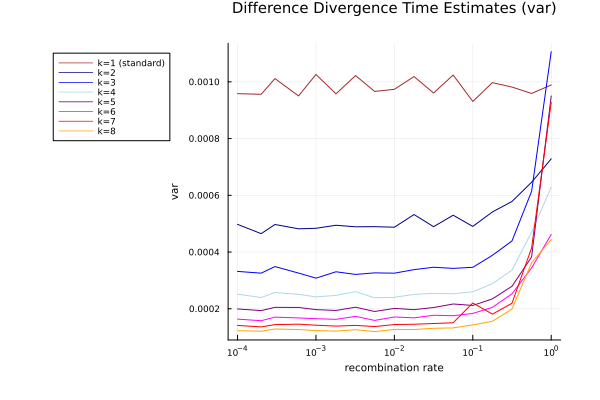

## Pipeline Steps

The DivergenceTimeEstimation pipeline assesses the improvement in divergence time estimation of individual segment trees when MCC information on shared branches with other trees is additionally available from `TreeKnit` inference. Divergence tim estimation is completed in [TreeTime](https://github.com/neherlab/treetime).

1. Use the julia package [ARGTools](https://github.com/PierreBarrat/ARGTools) to simulate recombination of eight segments with the flu/kingman coalescence model. See the [docs](https://github.com/PierreBarrat/ARGTools/tree/extended_newick_clean#simulations) for information on how these simulations are completed.  Obtain individual segmnet trees for each segment in the ARG. 
2. Simulate the evolution of nucleotide sequences for each individual segment tree, using the JC69 model [TreeAlgs.Evolve](https://github.com/anna-parker/TreeAlgs-Fork). The length of each sequence has been set to 1000 for simplicity. The mutation rate is set to be proportionate to the rate of coalescence and the desired resolution rate. Trees generated in ARGTools have branch lengths which correspond to generation times whereas in TreeTime branches correspond to mutation length - thus to convert these two entities a mutation rate of $$\mu = \frac{1}{NL},$$ should be chosen where $N$ is the population size and $L$ is the sequence length. However, typically influenza has a resolution rate of approximately 0.3 (ratio internal branches to leaves). As polytomies typically correspond to internal branches with zero nucleotide mutations I modify the mutation rate to reflect this $$\mu = \frac{4}{3}\frac{1}{cNL}.$$ The parameter $c$ is determined in [MTKTools](https://github.com/anna-parker/MTKTools), it corresponds to branches being removed with likelihood $e^{\frac{-\tau}{cN}}$, and has been chosen to result in trees with a resolution rate of approximately 0.3. Whereas in the poisson mutation model a branch of length $\tau$ has no mutations with probability $e^{-\mu \tau}$. 
3. Write the nucleotide sequences of the terminal nodes of each tree to `.fasta` files
4. Modify the branch length $\tau$ a random normally distributed error term $\epsilon \sim \mathcal{N}(0, 0.05)$, $\epsilon$ is further restricted to the interval $[-1, 1]$: $$\tau^* = (1-\epsilon)\tau.$$ These are the trees `treetime` recieves as input. 
5. Create `metadata.csv` files with the dates of terminal nodes (as all terminals are at the same generation time they are all set to the same date).
6. To determine if the `arg` functionality improves inference, run `TreeTime` on single trees (standard `treetime`), as well as on subsets of trees together with the MCC information (`arg` functionality). TreeTime takes as input nucleotide sequences (either for all sequences or just the terminal nodes) and tree structure (.nwk file), we use probabilistic ancestral reconstruction which takes the initial branch lengths of the input tree as a starting point to optimize using the mutated sequences.
	- `treetime` with `arg` functionality: `treetime` takes a date file of terminal nodes (`metadata.csv`), alignment sequences (`.fasta` files) and tree structure files (`.nwk` files) of each tree (with removed branch lengths) and MCCs (`.dat` files). TreeTime can estimate divergence times of the internal nodes of each tree. 
	-  Standard `treetime`: `treetime` takes a date file of terminal nodes (`metadata.csv`), an alignment sequence (`.fasta` file) and tree structure file (`.nwk` file) with removed branch lengths. TreeTime estimates divergence times of the internal nodes of each tree.
7. Compare estimated divergence times of internal nodes to true divergence times of the non-modified tree.
8. Plot results.

## Divergence Time Inference in TreeTime

TreeTime will estimate mutation lengths as well as branch lengths, mutation lengths are directly proportional to the number of mutations on a branch and branch lengths take further information about the tip dates into consideration. In our case all tips have the same date. Thus, the branch length estimate should be slightly closer to the true branch length of the trees used to simulate data than the mutation length. The mutation length is estimated as follows.

The number of mutations on a branch of length $\tau$ is Poisson distributed $$n_{mut} \sim Pois(\mu \tau)$$, where $\mu$ is the mutation rate, thus the variance and mean number of expected mutations on a branch of length $\tau$ is $\mu \tau$. If $\mu$ is known this relation can be used to estimate the branch length (here: mutation length) given the number of seen mutations, i.e. $$\tau^{infer} = \frac{n_{mut}}{\mu}$$, this estimator has expectation $\tau$ and variance $\frac{\tau}{\mu}$. When this is repeated $L$ times (i.e. for a sequence of $L$ nucleotides, each with mutation rate $\mu$), the average number of mutations is normally distributed with mean $\mu \tau$ and standard error $\frac{\mu \tau}{\sqrt{L}}$. Taking a larger sample, i.e. a larger nucleotide sequence should decrease the standard error.

### Case 1.: No reassortment occurs on a branch
Assume the simple case where we have taken a $K=2$ subsample of segment trees, and we are trying to optimize `tree 1` using `tree 2`, the sequence information of the leaves of `tree 1` and `tree 2`, as well as their `MCC` information. Further assume that that no reassortment has occured on a branch $b$ with length $\tau$, and for further simplicity assume that no reassortment events have happened in the clade below $b$ . The $arg$ command in $TreeTime$ will thus use the combined sequence information from both segment trees to infer the branch length of $b$. Thus, the difference we see when using the original treetime command on one tree and using the $arg$ command on two trees should be the same as the difference we see when using the treetime command on one tree of sequence length $L$ and one tree of sequence length $2L$. This is equivalent to a change in standard deviation of $\sigma = \frac{\sqrt{\mu \tau}}{\sqrt{L}}$ to $\frac{\sqrt{\mu \tau}}{\sqrt{2L}}$ for a branch with true length $\tau$. However, as branches in our simulation have a variable branch length and we are only interested in the standard error in our estimate we normalize our samples by the square root of the true branch length. This gives us a standard error of $$\frac{\sqrt{\mu}}{\sqrt{K L N}}$$ for the average number of mutations estimate and $$\frac{1}{\sqrt{\mu K L N}}$$ for the mutation length estimate of all branches, where $N$ is the number of branches in our sample.

### Case 2.: Reassortment occurs on a branch
Again, assume the simple case where we have taken a $K=2$ subsample of segment trees, and we are trying to optimize `tree 1` using `tree 2`, the sequence information of the leaves of `tree 1` and `tree 2`, as well as their `MCC` information. But now assume that a reassortment event has occured "on branch $b$" (technically above the node that corresponds to branch $b$). When a reassortment event happens on a branch the information from the other segment cannot be used when infering the branch length in the current segment tree, leading to a standard error of $$\frac{1}{\sqrt{\mu L N}}$$ - which is the same as when the other segment tree is not used. 

In conclusion, the inference improvement should be proportional to the number of recombination sites. When there are many recombination sites there is not much additional information gain from the other tree and the standard error of infered divergence times should be similar to the original TreeTime approach. However, when recombination happens infrequently there should still be an improvement. As a branch either has a recombination or not the standard error of these measurements can be determined from the fraction of branches with recombination and without recombination. Assuming recombination happens on one branch in a tree independently of other branches (not true sadly as larger branches are more likely to have recombination events) the standard error of of branch estimates should be approximately $$\frac{\sigma}{N} \sqrt{\frac{N_{rec}}{L_{HA}} + \frac{N_{norec}}{(L_{HA}+ L_{NA})}}$$.

## Selected Results

We see the expected improvement in the standard error of divergence times estimations - seen here with the variance of the normalized difference between the true and estimated branch length (normalized by the square root of the true branch length). As expected for low reassortment rate in both the Kingman and flu model the variance decreases by a factor of $K$. 

  

<em>Left: ARGs simulated under flu coalescence model, resolution rate 0.35 and strict resolve, Right: ARGs ARGs simulated under kingman coalescence model, resolution rate 0.35 and strict resolve,</em>

As to be expected this improvement starts decreasing faster with trees simulated under the Kingman model - most likely due to the fact that Kingman trees have more reassortments and thus less shared branches than Flu trees even with the same reassortment rate (see explanation in the `AccuracySharedBranches` section).

We note that although no branches are removed in this simulation for better comparison of the final trees - mutations occur at a rate that is proportional to the resolution rate - i.e the number of branches with no mutations would result in trees with a 0.35 resolution rate if internal branches with no mutations were to be removed. This can be seen when we look at the median and mean difference in inferred branch length. For $K=1$ the median difference is 1 - this makes sense as at resolution rate 0.35 the major of branches will not have mutations and will have inferred branch length 0. The decrease in difference with increasing $K$ shows the impact of using sequence information from other trees - made possible with the ARG module in TreeTime. 

  

<em>Left: ARGs simulated under flu coalescence model, resolution rate 0.35 and strict resolve, Right: ARGs ARGs simulated under kingman coalescence model, resolution rate 0.35 and strict resolve,</em>

  

<em>Left: ARGs simulated under flu coalescence model, resolution rate 0.35 and strict resolve, Right: ARGs ARGs simulated under kingman coalescence model, resolution rate 0.35 and strict resolve,</em>

We also note the large outliers seen for higher reassortment rates in the mean branch length differences. This is most likely due to the impact of FP shared branches - however more simulations would be needed to properly assess this. 
