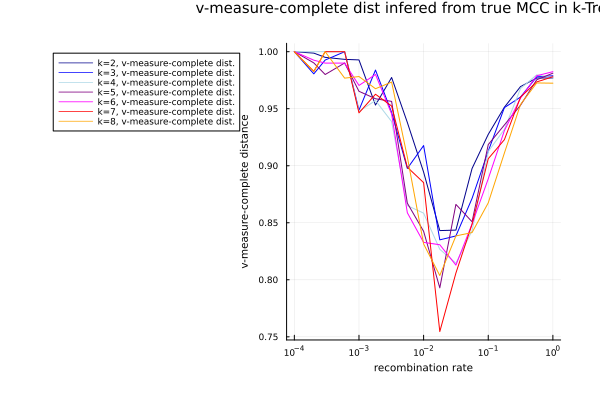
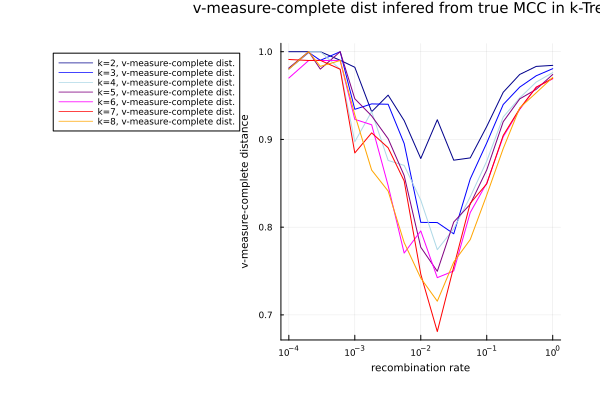
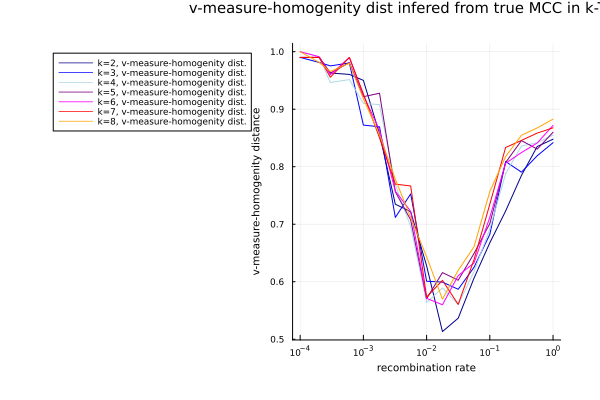
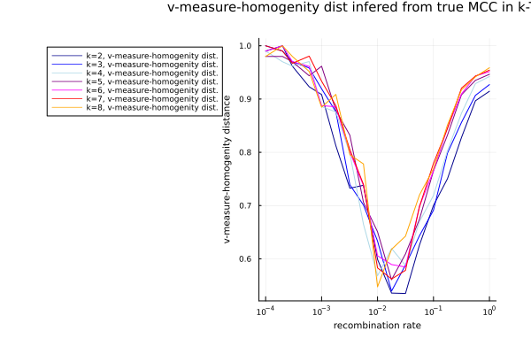

## Pipeline Steps

The MCC Accuracy Simulation pipeline assesses the improvement in MCC inference when MultiTreeKnit is used, as opposed to when standard TreeKnit is used with only two tree segments. Influenza is comprised of 8 segments, MCCs (maximally compatible clades) are clades that are shared between any pair of segment trees. When MultiTreeKnit is applied to $K$ segment trees it calculates the MCCs of all $\frac{K(K-1)}{2}$ tree pairs. As reassortments between tree pairs are not independent and additionally input trees are typically not fully resolved information from other trees and other MCCs can be useful in the calculation of individual MCCs, see the [MultiTreeKnit docs](https://github.com/PierreBarrat/TreeKnit.jl/blob/MTK_clean/docs/src/multitreeknit.md) for more information on how this is done in MultiTreeKnit. 

1. Use the julia package [ARGTools](https://github.com/PierreBarrat/ARGTools) to simulate recombination of eight segments with the flu/kingman coalescence model. See the [docs](https://github.com/PierreBarrat/ARGTools/tree/extended_newick_clean#simulations) for information on how these simulations are completed.  Obtain individual segmnet trees for each segment in the ARG as well as the real MCCs for each tree segment pair.
2. Randomly remove internal branches with probability $$e^{\frac{-\tau}{cN}}.$$ The parameter $N$ corresponds to the population size and $\tau$ is the branch length - branches are scaled to generation number as ARGTools uses a coalescence model. The parameter $c$ is determined in [MTKTools](https://github.com/anna-parker/MTKTools) and has been chosen to result in trees with a desired resolution rate (typically between 0.3 and 0.4 for influenza).
3. Take random subsamples of size $2 \leq K \leq 8$ trees and use MultiTreeKnit to infer the MCCs of all tree pairs in this random subset. (The $K=2$ case corresponds to standard TreeKnit). 
4. Use the [TestRecombTools](https://github.com/PierreBarrat/TestRecombTools) to assess the accuracy of the MCC inference using the VI and the Rand distance as well as the homogenity and the completeness of the real and inferred MCC "clusterings" (see below). 
5. Write a summary of results to a txt file.
6. Plot results.
7. Remove unnecessary files and zip output files.

#### Rounds Pipeline

This directory also contains a subdirectory with a pipeline to assess the impact of multiple rounds on MCC inference - the same technique is employed as above except that now the number of rounds used in MultiTreeKnit is an additional parameter. TreeKnit allows users to set the number of rounds of inference - if rounds is set to greater than 1 after the initial MCC inference and tree pair resolution TreeKnit will use the resolved trees from the previous round as input and the computed MCCs as a consistency constraint (if `consistent = true`) for this round of MCC inference and tree resolution.

## MCC measures

MCCs can be viewed as a clustering of leaves. We assess the accuracy of inferred MCCs by their similarity to true MCCs by using a number of clustering metrics. The two most widely used methods are the Rand index / Rand distance and the VI index / VI distance. All distances are normalized to be on the scale of 0 to 1, where 0 means no distance or the same distribution. We also compute the homogenity and completeness of the inferred MCCs which allows us to better quantify the clustering properties of the inference. All these measures are computed using the julia [Clustering.jl](https://juliastats.org/Clustering.jl/dev/validate.html) package. 

#### Rand distance

The Rand index is a classic method to measure the similarity of two different classifications of elements, assuming one classification is the true classification and the other the estimate the rand index can be defined as $$RI = \frac{TP + TN}{TP + FP + TN + FN}.$$

It is calculated by taking all possible combination of elements that are classified and assessing whether or not they are in the same class in both classifications. For example if two elements are both in the same class in the true and in the estimated classification they are part of the TP set - if they are in the same  class in the true distribution but not in the estimated distribution they are part of the FN. 

Typically a Rand index of 1 means that the two distributions are the same, however we plot the Rand distance which we define to be $$1 - RI.$$
#### VI distance

The variation of information of the variables $X$ and $Y$ with probability distributions $p_X$ and $p_Y$ is defined as $$VI(X, Y) = H(X) + H(Y) - 2 I(X; Y) = H(X |Y) + H(Y | X).$$ $H(X)$ is the entropy of $X$ and $I(X; Y)$ is the mutual information of $X$ and $Y$.

The VI distance quantifies the additional information gained from each of the two variables. This means that if the two variables $X$ and $Y$ have the same distribution their VI distance will be zero. Furthermore, the VI is scaled by the logarithm of the number of leaves in a tree to allow for comparison across simulations. 

#### V-measure - homogenity and completeness

The VI distance gives us little information on how clusterings differ from each other. Thus, it makes sense to also compute the homogenity and the completeness of a clustering. To do this we use the [v-measure](https://www.researchgate.net/publication/221012656_V-Measure_A_Conditional_Entropy-Based_External_Cluster_Evaluation_Measure). Assume we have the real MCC distribution $M_R$ and the inferred distribution $M_I$. 

$M_I$ is `homogeneous` if we only assign leaves that are members of the same real MCC to an inferred MCC (leaves in the same real MCC might be split up amongst inferred MCCs). If $M_R$ is fully determined by $M_I$, then $H(M_R | M_I) = 0$, furthermore the maximal value that $H(M_R | M_I)$ could take on is $H(M_R)$.

$$
h = \begin{cases}
    1 & \text{if } H(M_R, M_I) = 0 \\
    1 - \frac{H(M_R | M_I)}{H(M_R)} & \text{else}
\end{cases}
$$

$M_I$ is `complete` if all leaves that are part of the same real MCC are assigned to the same inferred MCC (this still allows inferred MCCs to contain leaves from multiple real MCCs). If $M_I$ is fully determined by $M_R$, then $H(M_I | M_R) = 0$, furthermore the maximal value that $H(M_I | M_R)$ could take on is $H(M_I)$ - this would occur each real MCC is represented by every inferred MCCs with a distribution equal to the distribution of inferred MCC sizes.

$$
c = \begin{cases}
    1 & \text{if } H(M_R, M_I) = 0 \\
    1 - \frac{H(M_I | M_R)}{H(M_I)} & \text{else}
\end{cases}
$$

Now the V-measure of $M_R$ and $M_I$ is defined as $$V_{\beta}(M_R, M_I) = (1 + \beta) \frac{h \cdot c}{\beta h + c}$$ where $0 \leq \beta \leq \infty$. Inorder to compute $h$ and $c$ I use the relationship 
$$V_{0}(M_R, M_I) = h$$
$$V_{0}(M_I, M_R) = c$$

## Selected Results 

We do not see much improvement with increasing $K$ in the VI or rand index, especially when we use liberal resolve. When strict resolve is used an improvement starts to be seen for higher recombination rates and lower levels of resolution. But still, this is not very prominent. 

We notice a difference between the Kingman and the flu model and the distance distribution - with the greatest distances seen slightly earlier in the Kingman model. This is most likely due to the fact that Kingman has more reassortment events than flu for the same recombination rate (see `AccuracySharedBranches`). 

The difference between the rand index and the VI distance is also visible - at higher recombination rates the rand distance decreases faster than the VI distance.

We do not see a prominent difference between when the consistent parameter is used or not. 

The v-measure of homogenity and completeness gives us a better overview of how TreeKnit calculates MCCs. Completeness decreases with increasing $K$ - i.e. MCCs are split up too much, however this is more prominent when liberal resolve is used than when strict resolve is used. Homogenity however increases with $K$ (at a slightly lower rate than completeness decreases). This is again slightly more prominent with liberal resolve than with strict resolve. 

  

<em>Left: ARGs simulated under kingman coalescence model and resolution rate 0.3 and strict resolve, Right: ARGs simulated under kingman coalescence model and resolution rate 0.3 and liberal resolve</em>

  

<em>Left: ARGs simulated under kingman coalescence model and resolution rate 0.3 and strict resolve, Right: ARGs simulated under kingman coalescence model and resolution rate 0.3 and liberal resolve</em>