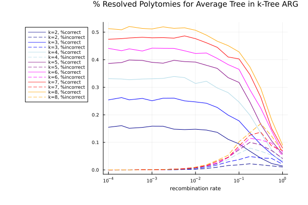

## Pipeline Steps

The Polytomy Resolution Simulation pipeline assesses the improvement in tree reconstruction when MultiTreeKnit is used, as opposed to when standard TreeKnit is used with only two tree segments. Influenza is comprised of eight RNA segments, segments can reassort leading to each segment having a potentially unique ancestry. Therefore, each segment is typically used individually to reconstruct a separate phylogenetic divergence tree. The most widely used segments are NA and HA which are each approximately 1.5kB, at influenza's standard rate of mutation NA and HA segments are often not very diverged, meaning that multiple sequences might have the same sequence or a similar enough sequence such that a binary tree structure cannot be reconstructed from the data. Internal nodes often have multiple children, this is called a polytomy. In such a case we say that a tree is not full resolved - in NA and HA the resolution rate (ratio of internal nodes to leaves in a tree) is approximately 0.3. This means that much of the true tree structure is lost. 

An unresolved tree is equivalent to removing internal branches from a fully resolved (binary) tree. While inferring maximally compatible clades (MCCs) between a tree pair TreeKnit additionally tries to resolve each tree by adding internal branches from the other tree if they are compatible - i.e. in a MCC trees should share topology and a branch in a MCC seen in one segment tree due to mutations in that segment can be added to the other segment tree even if no mutations occurred there.

1. Use the julia package [ARGTools](https://github.com/PierreBarrat/ARGTools) to simulate recombination of eight segments with the flu/kingman coalescence model. See the [docs](https://github.com/PierreBarrat/ARGTools/tree/extended_newick_clean#simulations) for information on how these simulations are completed. Obtain individual segment trees for each segment in the ARG.
2. Randomly remove internal branches with probability $$e^{\frac{-\tau}{cN}}.$$ The parameter $N$ corresponds to the population size and $\tau$ is the branch length - branches are scaled to generation number as ARGTools uses a coalescence model. The parameter $c$ is determined in [MTKTools](https://github.com/anna-parker/MTKTools) and has been chosen to result in trees with a desired resolution rate (typically between 0.3 and 0.4 for influenza).
3. Take random subsamples of size $2 \leq K \leq 8$ trees and use MultiTreeKnit to infer the MCCs of all tree pairs in this random subset, in this process TreeKnit will additionally resolve each tree using every other tree (The $K=2$ case corresponds to standard TreeKnit). 
4. Compute the improvement in tree reconstruction using the RF distance between true trees and trees seen and resolved by TreeKnit. Additionally, calculate the accuracy of the new branches using splits.
5. Write a summary of results to a txt file.
6. Plot results.
7. Remove unnecessary files and zip output files.

#### Rounds Pipeline

This directory also contains a subdirectory with a pipeline to assess the impact of multiple rounds on tree reconstruction - the same technique is employed as above except that now the number of rounds used in MultiTreeKnit is an additional parameter. TreeKnit allows users to set the number of rounds of inference - if rounds is set to greater than 1 after the initial MCC inference and tree pair resolution TreeKnit will use the resolved trees from the previous round as input and the computed MCCs as a consistency constraint (if `consistent = true`) for this round of MCC inference and tree resolution.

## Tree resolution metrics

Comparing branches with varying topologies presents various challenges. This is why we identify branches using splits. If a branch between a node and its ancestor is removed from a tree the tree is "split" into two parts - the clade below the node (with the node as it's root) and the rest of the tree. Each of these parts can be identified by the leaves in it. Thus, a split is a tuple of leaves and there exists a unique mapping from a branch in a tree to a split.

#### RF (Robinson–Foulds) distance 

The RF distance of two trees (with the same leaves) is defined as the the number of unique splits in each tree, or $$RF(T_1, T_2) = |S_1| + |S_2| - 2*| S_1 \cap S_2 |,$$ typically this is still scaled by the maximal RF distance which is $$|S_1| + |S_2| - 2$$ (the root always has the same split).

In the plots we show the improvement in RF distance after the unresolved trees $T_i$ have been resolved by TreeKnit during MCC inference $\hat{T_i}$ i.e. $$RF(T_i, T_j) - RF(\hat{T_i}, \hat{T_j}).$$

#### New Split Accuracy

Furthermore, we actually know which exact splits are missing from the tree unresolved tree and which are added by TreeKnit. This allows us to plot the fraction of missing splits that are correctly added back by TreeKnit and the fraction of incorrect splits (also scaled by the total number of missing splits for easier comparison).

## Selected Results

The amount of polytomies that can be resolved is related to the resolution rate of the trees in the ARG - the more resolved the higher the percentage of missing polytomies that can be properly resolved. The number of incorrectly added branches is also related to the resolution rate. Again, the higher the resolution rate the less incorrect branches are added to the tree - leading to more accurate results. 

  

<em>Left: ARGs simulated under flu coalescence model and resolution rate 0.3 and strict resolve, Right: ARGs simulated under flu coalescence model and resolution rate 0.4 and strict resolve</em>

The Kingman and flu simulation model lead to slightly different plot structures. The percentage of correctly determined branches decreases faster in Kingman than in flu - this is most likely due to the fact that the average number of reassortments is slightly higher in the Kingman model - leading to on average less shared branches between trees (if a branch is not shared with another tree, even if that tree is known no information from that other tree can be used to reconstruct it). For more information see the `AccuracySharedBranches` section. 

  

<em>Left: ARGs simulated under flu coalescence model and resolution rate 0.3 and strict resolve, Right: ARGs simulated under kingman coalescence model and resolution rate 0.3 and strict resolve</em>

There is a striking difference between liberal and strict resolve when it comes to the amount of incorrectly added branches. This is especially visible for less resolved trees and for higher recombination rates. 

  

<em>Left: ARGs simulated under flu coalescence model and resolution rate 0.3 and strict resolve, Right: ARGs simulated under flu coalescence model and resolution rate 0.3 and liberal resolve</em>

The RF distance plots are very similar to the split accuracy plots and as they convey less information I will only show two examples here. 

  

<em>Left: ARGs simulated under flu coalescence model and resolution rate 0.4 and strict resolve, Right: ARGs simulated under flu coalescence model and resolution rate 0.4 and liberal resolve</em>

Again we note that the `consistent` parameter has little to no impact on our results. 

  

<em>Left: ARGs simulated under flu coalescence model and resolution rate 0.3 and strict resolve, Right: ARGs simulated under flu coalescence model and resolution rate 0.3, strict resolve and the consistent parameter</em>

  

<em>Left: ARGs simulated under flu coalescence model and resolution rate 0.3 and liberal resolve, Right: ARGs simulated under flu coalescence model and resolution rate 0.3, liberal resolve and the consistent parameter</em>

When we look at the impact of the number of `rounds` used in TreeKnit we see that increasing the number of rounds actually has little impact on the number of correct splits - and the increase in correct splits is similar to the increase in incorrect splits - leading us to believe that increasing the number of rounds used is unlikely to be beneficial. This is also seen quite well with the RF distance that appears to be quite unaffected by the number of rounds. 

  

<em>Left and Right: ARGs simulated under Kingman coalescence model, resolution rate 0.3 and strict resolve </em>

We also investigated the impact of the `pre-resolve` parameter as well as the `final-no-resolve` parameter.